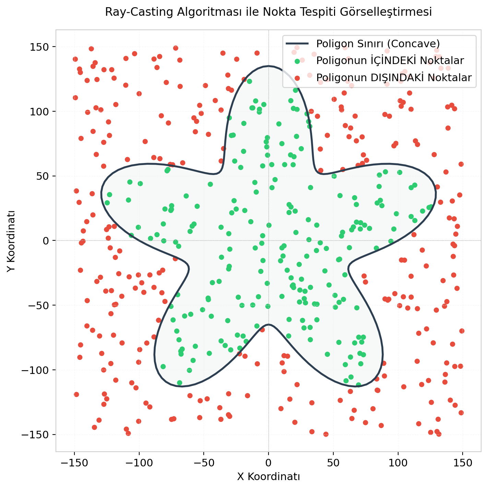

# Hibrit Paralel Point-in-Polygon (PIP) GIS Çözücü

[](https://en.cppreference.com/)
[](https://www.openmp.org/)
[](https://software.intel.com/content/www/us/en/develop/documentation/cpp-compiler-developer-guide-and-reference/top/compiler-reference/intrinsics.html)
[](https://www.python.org/)
[](https://matplotlib.org/)

Bu proje, çukur (concave) veya tümsek (convex) poligonlar için bir noktanın poligonun içinde olup olmadığını saptayan **Ray-Casting (Even-Odd) algoritmasını** uzamsal indeksleme (**BVH**), donanım seviyesinde **AVX2 SIMD vektörleştirmesi** ve çoklu çekirdek **OpenMP paralelleştirmesi** kullanarak çözen yüksek performanslı bir Coğrafi Bilgi Sistemi (GIS) sorgu motoru prototipidir.

Bu çalışma, **Paralel Programlama** dersi dönem projesi kapsamında geliştirilmiştir. (4. Grup - +10 Bonus Puan).

---

## 🚀 Öne Çıkan Özellikler

1. **Bounding Volume Hierarchy (BVH) Uzamsal İndeksi:**
   - Poligon kenarlarını hiyerarşik sınırlayıcı kutulardan (BBox) oluşan dengeli bir ikili arama ağacında organize eder.
   - Arama esnasında ışınla kesişmeyen alt bölgeleri tek işlemle budayarak (pruning) sorgu karmaşıklığını $O(N)$'den **$O(\log N)$** seviyesine indirir.
   - Rekürsif stack frame yüklerinden kaçınmak için thread yerel belleğinde çalışan **iteratif yığın (stack-based) traversi** kullanır.
2. **AVX2 SIMD Donanım Vektörleştirmesi:**
   - C++ intrinsics yazmaçları (`__m256d`) kullanılarak 256-bit genişliğinde 4 kenar koordinatı tek bir CPU saat çevriminde paralel işlenir.
   - Koşullu dallanmalar (branching) ortadan kaldırılarak dallanma tahmin hatası (branch misprediction) gecikmeleri sıfırlanmıştır.
3. **Çoklu Çekirdek OpenMP Paralelliği:**
   - **Senaryo A (Kenar Seviyesi):** Tek bir noktanın devasa poligonlar ($10.000.000$ kenara kadar) içindeki durumunu OpenMP reduction döngüleriyle paralelleştirir.
   - **Senaryo B (Nokta Seviyesi):** Çoklu nokta sorgularında ($100.000$ noktaya kadar) yük dengesizliğini önlemek için dinamik zamanlama (`schedule(dynamic, 64)`) kullanır.
4. **Otomatik Test ve Görselleştirme Betiği:**
   - Python otomasyon scripti C++ kodunu otomatik derler, benchmark testlerini koşar, istatistiksel ortalamaları hesaplar ve süre karşılaştırma grafikleri ile poligon içi/dışı noktaları gösteren 2D bir görsel harita üretir.

---

## 📊 Performans ve Hızlanma Verileri

Ölçümler, **16 Mantıksal Çekirdekli (8 Fiziksel Çekirdek)** dual-channel RAM mimarisine sahip bir x64 işlemci üzerinde yapılmıştır.

### Senaryo A: Tek Nokta Sorgusu, Devasa Poligon ($N = 10.000.000$)
- **Sıralı Naive (Kaba Kuvvet):** 14.30 ms
- **AVX2 SIMD + OpenMP (8 Thread):** 6.37 ms (**2.42x** hızlanma - 160MB veri boyutundan dolayı RAM bant genişliği darboğazına (Memory Wall) takılmıştır).
- **BVH Uzamsal İndeks Arama:** **0.0135 ms (13.5 mikrosaniye)**.
- **Sonuç:** Algoritma seviyesindeki BVH indeksleme, sıralı naive yönteme göre **1059 kat hızlanma ($1059x$)** sağlamıştır.

### Senaryo B: Çoklu Nokta Sorgusu ($N = 100.000$ kenar, $M = 100.000$ nokta)
- **Sıralı Naive (Kaba Kuvvet):** 8.682,57 ms (8.68 saniye)
- **Sıralı BVH İndeks:** 56.91 ms (152 kat hızlı)
- **OpenMP + BVH İndeks (16 Thread):** **3.78 ms** (0.003 saniye)
- **Ölçeklenme:** BVH ağacı önbelleğe (Cache) sığdığı için bellek darboğazı oluşmaz ve OpenMP 16 thread altında **15.05x** doğrusal hızlanma sağlar.
- **Toplam Proje Hızlanması:** Sıralı naive koda kıyasla paralel BVH sürümü **2296 kat daha hızlı ($2296x$)** çalışmaktadır.

---

## 📁 Proje Dizin Yapısı

```
paralel proje/
├── src/
│   ├── bvh.hpp            # Uzamsal indeksleme veri yapıları ve arama kodları
│   ├── simd_helper.hpp    # AVX2 SIMD intrinsics vektörleştirme modülü
│   └── pip_parallel.cpp   # C++ ana benchmark ve doğrulama motoru
├── plots/                 # Otomatik üretilen grafikler ve görsel harita
│   ├── polygon_visualization.png
│   ├── speedup_multi_query.png
│   └── time_comparison_multi.png
├── benchmark.py           # Test otomasyonu ve grafik çizim betiği
├── convert_doc.py         # Markdown raporunu Word belgesine çeviren betik
├── rapor.md               # Türkçe Akademik Proje Raporu (Markdown)
├── rapor.docx             # Türkçe Akademik Proje Raporu (MS Word)
└── .gitignore             # Git sürüm kontrolü yoksayma dosyası
```

---

## 🛠️ Kurulum ve Çalıştırma Rehberi

### Önkoşullar
1. **C++ Derleyicisi:** GCC / MinGW-W64 (OpenMP ve AVX2 destekli).
2. **Python 3:** Gerekli kütüphaneleri yüklemek için:
   ```bash
   pip install numpy pandas matplotlib python-docx
   ```

### 1. Otomatik Test ve Grafik Üretiminin Çalıştırılması
C++ kodlarını otomatik derlemek, tüm benchmark test senaryolarını koşmak ve grafik çıktıları ile poligon görselleştirmesini üretmek için:
```bash
python benchmark.py
```
Çalışma bittiğinde grafikler ve görsel harita `plots/` klasörü altına kaydedilecektir.

### 2. İnteraktif Grafik Arayüzünün (GUI) Çalıştırılması
Kullanıcının kendi poligonunu çizip nokta testi yapabileceği sandbox ekranını ve hız kıyaslama grafiklerini gösteren modern arayüzü başlatmak için:
```bash
python gui.py
```
*(Not: `customtkinter` ve `Pillow` kütüphanelerinin kurulu olması gerekir. Kurulum için: `pip install customtkinter Pillow`)*

### 3. Manuel Derleme ve Çalıştırma
Projeyi manuel olarak derlemek ve CLI parametreleriyle çalıştırmak isterseniz:

**Derleme:**
```bash
g++ -O3 -fopenmp -mavx2 src/pip_parallel.cpp -o pip_parallel
```

**Tek Nokta Sorgusu Benchmark Modu (N = 10M kenar, T = 4 thread):**
```bash
./pip_parallel --mode single --N 10000000 --threads 4
```

**Çoklu Nokta Sorgusu Benchmark Modu (N = 100k kenar, M = 50k nokta, T = 8 thread):**
```bash
./pip_parallel --mode multi --N 100000 --M 50000 --threads 8
```

---

## 📈 Görsel Doğrulama Sonuçları

Geliştirdiğimiz çözücü tarafından test edilen 200 kenarlı çukur yıldız poligonu ve sorgulanan 500 rastgele noktanın dağılımı (yeşil noktalar poligonun içini, kırmızı noktalar dışını temsil eder):

<p align="center">
  
</p>

---

## 📝 Akademik Rapor Dosyaları
Üniversite isterlerini eksiksiz karşılayan Türkçe akademik proje raporu iki formatta sunulmuştur:
- **Markdown Raporu:** [rapor.md](rapor.md) (VS Code veya GitHub üzerinde hızlı okumak için).
- **Microsoft Word Raporu:** [rapor.docx](rapor.docx) (Doğrudan üniversite teslimi için).

