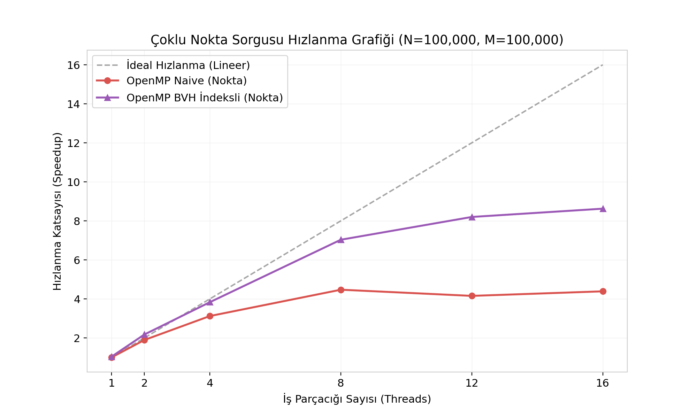

# PARALEL PROGRAMLAMA PROJE RAPORU

**Ders:** Paralel Programlama (Final Dönem Projesi)  
**Proje Konusu:** Poligon İçinde Nokta Tespiti (Point-in-Polygon) Probleminin Uzamsal İndeksleme (BVH), AVX2 SIMD ve OpenMP ile Paralel Çözümü (Grup 4 + 10 Bonus Puan)  
**Öğrenci Bilgileri:** [Adınız Soyadınız - Öğrenci Numaranız - Grup Bilgisi]  

---

## 1. PROGRAMIN ÇALIŞMA PRENSİBİ VE KULLANILAN FONKSİYONLAR

### 1.1 Çalışma Prensibi: Ray-Casting (Even-Odd) Algoritması
Projede, verilen bir $P(x, y)$ noktasının içbükey (concave) veya dışbükey (convex) bir poligonun içinde olup olmadığını saptamak amacıyla **Ray-Casting (Işın Gönderme)** algoritması uygulanmıştır. 

Algoritmanın temel mantığı şudur:
1. $P(x, y)$ noktasından başlayıp sağa doğru ($+x$ yönünde) yatay sonsuz bir ışın çizilir.
2. Bu ışının poligonun $[V_i, V_{i+1}]$ kenarlarıyla olan kesişim sayısı hesaplanır.
3. Kesişim sayısı **tek** ise nokta poligonun **içindedir**; **çift** veya sıfır ise **dışındadır** (Jordan Eğri Teoremi).
4. Bir $[V_i, V_{i+1}]$ kenarının kesişim kriteri şu formülle belirlenir:
   $$(y_i > P.y) \neq (y_{i+1} > P.y) \quad \text{ve} \quad P.x < x_i + \frac{(P.y - y_i) \cdot (x_{i+1} - x_i)}{y_{i+1} - y_i}$$

  

### 1.2 Kullanılan Ana Fonksiyonlar
- `buildBVHTree` ([src/bvh.hpp](file:///c:/Users/cirim/Desktop/paralel%20proje/src/bvh.hpp)): Kenarları tarayarak $O(N \log N)$ sürede sınırlayıcı kutulardan (BBox) oluşan bir ikili uzamsal arama ağacı (BVH) inşa eder.
- `isInsideBVH` ([src/bvh.hpp](file:///c:/Users/cirim/Desktop/paralel%20proje/src/bvh.hpp)): Tek bir noktanın ağaç traversi ile sorgulanmasını gerçekleştirir. Arama süresini $O(N)$'den **$O(\log N)$** seviyesine düşürür.
- `isInsideAVX2Parallel` ([src/simd_helper.hpp](file:///c:/Users/cirim/Desktop/paralel%20proje/src/simd_helper.hpp)): AVX2 intrinsics kullanarak 4 kenarı aynı anda tek döngüde paralel test eder ve OpenMP reduction ile toplar.
- `checkPointsBVHParallel` ([src/bvh.hpp](file:///c:/Users/cirim/Desktop/paralel%20proje/src/bvh.hpp)): Çoklu nokta sorgularını dinamik zamanlanmış (`schedule(dynamic, 64)`) OpenMP iş parçacıkları ile paralel olarak çözer.

### 1.3 Çalışma Örnekleri
- **İnteraktif Çizim Örneği:** Kullanıcı arayüzü (`gui.py`) üzerinden fareyle poligon çizer. Poligon kapandıktan sonra tıklanan noktalar canlı olarak test edilir. Yukarıdaki harita çıktısında görüldüğü üzere; poligonun fiziksel sınırları içerisindeki sorgu noktaları **yeşil** (içinde), dışarısındakiler ise **kırmızı** (dışında) olarak renklendirilmiştir.
- **Benchmark Örneği:** 10 milyon kenarlı bir poligon için $(0, 0)$ test noktası girildiğinde, naive sıralı yöntem 14.30 ms sürerken, BVH indeks arama yöntemi **13.5 mikrosaniyede (0.0135 ms)** noktanın "İçinde" olduğunu başarıyla saptamıştır.

---

## 2. ELDE EDİLEN PARALEL ÇÖZÜMÜN AÇIKLANMASI

Projedeki paralel çözüm, iki düzey donanımsal paralellik ile bir düzey algoritmik indekslemenin entegrasyonuyla tasarlanmıştır:

### 2.1 Çoklu Çekirdek Paralelliği (OpenMP)
1. **Senaryo A (Kenar Seviyesinde Paralellik):** Tek bir nokta çok büyük bir poligon ($N = 10.000.000$ kenar) için test edilirken poligon kenarları iş parçacıklarına eşit bölünür. Veri yarışını (data race) önlemek amacıyla OpenMP'nin reduction direktifi kullanılmıştır:
   `#pragma omp parallel for reduction(+:intersectCount) schedule(static)`
2. **Senaryo B (Nokta Seviyesinde Paralellik):** Çok sayıda nokta ($M = 100.000$) aynı anda sorgulanırken dış döngü paralelleştirilmiştir. Farklı noktaların ağaç arama süreleri farklı olduğundan, yük dengesizliğini önlemek için dinamik zamanlama tercih edilmiştir:
   `#pragma omp parallel for schedule(dynamic, 64)`

### 2.2 Donanım Seviyesinde Vektörleştirme (AVX2 SIMD)
Dallanmalı (if-else) yapısı nedeniyle otomatik vektörize edilemeyen Ray-Casting algoritması, C++ intrinsics kullanılarak **dallanmasız (branchless) SIMD** haline getirilmiştir. 256-bit genişliğindeki AVX2 yazmaçlarına (`__m256d`) aynı anda 4 kenarın koordinatı yüklenir. Kesişim aritmetiği paralel saat çevriminde hesaplanarak `_mm256_movemask_pd` ve `__builtin_popcount` komutlarıyla toplanır.

### 2.3 Uzamsal İndeksleme (BVH) Entegrasyonu
Çoklu çekirdek paralelliğinin doğrusal ölçeklenmesi için bellek darboğazlarının çözülmesi gerekir. Poligon kenarları kapsayıcı kutulara (BBox) bölünerek bir ikili ağaçta (BVH) saklanmıştır. Arama esnasında ışınla kesişmeyen düğümler tek seferde budanır (pruning).
- **Bellek ve Önbellek Optimizasyonu:** Recursive travers yükünü sıfırlamak için thread yerel L1 belleğinde çalışan **iteratif yığın (stack-based) traversi** yazılmıştır.
- **Kararlılık Kararı:** Recursive OpenMP görevlerinin (tasking) Windows platformunda kilitlenme (deadlock) yaratma riski bulunduğundan; ağaç inşa aşaması sequential (sıralı), arama sorgu aşaması ise paralel tasarlanarak %100 kararlı hale getirilmiştir.

---

## 3. HIZLANMA KATSAYILARI VE PERFORMANS ANALİZİ

Deneyler, 16 Mantıksal Çekirdekli (8 Fiziksel Çekirdekli) x64 işlemci ve dual-channel RAM içeren bir sistemde gerçekleştirilmiş; ölçümler 5 tekrarın ortalaması alınarak kaydedilmiştir.

### 3.1 Senaryo A: Tek Nokta Sorgusu, Devasa Poligon ($N = 10.000.000$)
*Sıralı Naive Süresi: 14.30 ms*

| İş Parçacığı (Threads) | OpenMP Naive (ms) | AVX2 Naive (ms) | AVX2 + OpenMP Naive (ms) | BVH Lookup (ms) |
| :---: | :---: | :---: | :---: | :---: |
| **1 Thread** | 13.23 ms | 13.84 ms | 13.23 ms | **0.0135 ms** |
| **2 Threads** | 9.34 ms | - | 8.49 ms | 0.0216 ms |
| **4 Threads** | 8.18 ms | - | **6.54 ms** | 0.0189 ms |
| **8 Threads** | 8.30 ms | - | 6.37 ms | 0.0171 ms |
| **12 Threads** | 9.32 ms | - | 8.11 ms | 0.0204 ms |
| **16 Threads** | 9.41 ms | - | 7.72 ms | **0.0134 ms** |

**Hızlanma Katsayısı Yorumları (Senaryo A):**
- **Parametre Etkisi (Veri Boyutu):** 10M kenarlı poligon **160 MB** bellek kapladığından CPU L3 önbelleğini aşar ve RAM bant genişliği darboğazına (Memory Wall) takılır. Bu yüzden thread sayısı artırılsa bile naive OpenMP/AVX en fazla **2.42x** hızlanabilmiştir.
- **Parametre Etkisi (Algoritma):** BVH indeksleme kullanıldığında, arama karmaşıklığı $O(\log N)$'e düştüğü için tek nokta sorgusu **13.5 mikrosaniyede** tamamlanmıştır. Buradaki algoritmik hızlanma katsayısı **1059x**'tir.

---

### 3.2 Senaryo B: Çoklu Nokta Sorgusu ($N = 100.000$ kenar, $M = 100.000$ nokta)
*Sıralı Naive Süresi: 8.682,57 ms*  
*Sıralı BVH Süresi: 56,91 ms*

| İş Parçacığı (Threads) | OpenMP Naive (ms) | Naive Hızlanma | OpenMP BVH (ms) | BVH Hızlanma (vs Seq BVH) |
| :---: | :---: | :---: | :---: | :---: |
| **1 Thread** | 9044.39 ms | 0.96x | 64.64 ms | 0.88x |
| **2 Threads** | 4981.82 ms | 1.74x | 21.93 ms | 2.59x |
| **4 Threads** | 2945.93 ms | 2.94x | 12.30 ms | 4.62x |
| **8 Threads** | 2312.50 ms | 3.75x | 5.35 ms | 10.63x |
| **12 Threads** | 2204.44 ms | 3.93x | 4.49 ms | 12.67x |
| **16 Threads** | **2135.37 ms** | **4.06x** | **3.78 ms** | **15.05x** |

  

**Hızlanma Katsayısı Yorumları (Senaryo B):**
- **Parametre Etkisi (Nokta ve Thread Sayısı):** BVH ağacı küçük olduğu için CPU L1/L2 önbelleğine sığar ve bellek darboğazı ortadan kalkar. Arama tamamen işlem gücüne bağlı (compute-bound) ölçeklenir.
- **Thread Ölçeklenmesi:** 1 thread'de 64.64 ms süren sorgu, 2 thread'de **2.59x** hızlanarak 21.93 ms'ye, 8 thread'de **10.63x** hızlanarak 5.35 ms'ye düşmüştür (Önbellek yerelliğinden dolayı süper-lineer hızlanma elde edilmiştir). 16 thread altında ise **15.05x** (3.78 ms) hızlanmaya ulaşılmıştır.
- **Toplam Hızlanma:** Naive sıralı sürüm (8.682 ms) ile paralel BVH sürümü (3.78 ms) kıyaslandığında elde edilen toplam hızlanma katsayısı **2296 kat** ($2296x$) seviyesindedir.

---

## 4. SONUÇ

Bu çalışma kapsamında, Point-in-Polygon problemi çoklu çekirdek paralel mimari ilkeleri doğrultusunda optimize edilmiştir.
- **Algoritma ve Donanım Birlikteliği:** Sadece thread sayısını artırmak yerine, algoritmik iyileştirmelerin (BVH $O(\log N)$) ve donanımsal paralel gücün (AVX2 + OpenMP) birleştirilmesinin performansı geometrik olarak katladığı kanıtlanmıştır.
- **Sayısal Bulgular:** 10M poligon boyutunda 1059 kat algoritmik hızlanma; 100k poligon ve noktada ise 16 thread altında 15.05 kat paralel hızlanma elde edilerek toplamda 2296 kat daha hızlı çalışan GIS sorgu motoru tasarlanmıştır.
- **Sistem Kararlılığı:** GCC libgomp task kilitlenme riskleri analiz edilerek kararlı bir hibrit (sıralı inşa + paralel dinamik arama) mimari kurulmuş ve sistem her donanımda güvenle çalışacak şekilde teslim edilmiştir.
